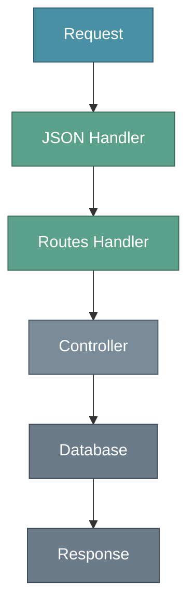
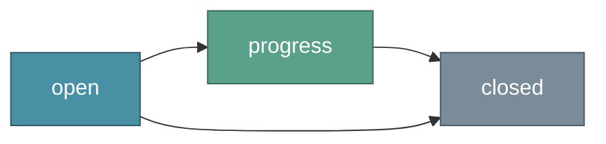
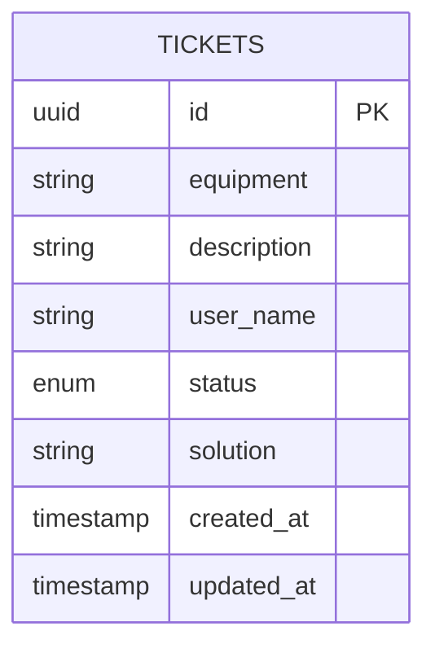

# API Support Tickets

API REST para gerenciamento de tickets de suporte técnico, construída com Node.js puro e TypeScript.

Desenvolvi esse projeto pra entender como o HTTP funciona de verdade, sem depender de frameworks como Express. Quis montar um sistema de rotas, middlewares e controllers do zero pra ter controle total sobre o que acontece em cada requisição. Foi um exercício bom pra entender o que os frameworks fazem por baixo dos panos.

---

## Funcionalidades

- Criação de tickets de suporte
- Listagem com filtro por status
- Busca por ID
- Atualização de informações
- Fluxo de status (open → progress → closed)
- Fechamento com solução obrigatória
- Validação de entrada com Zod
- 20 testes automatizados

---

## Arquitetura

O projeto usa Node.js puro com um sistema de rotas customizado:
```
src/
├── controllers/      # Lógica de cada endpoint
├── middlewares/      # JSON parser, router e error handler
├── routes/           # Definição das rotas
├── schemas/          # Validação com Zod
├── database/         # Persistência em JSON
├── utils/            # Utilitários (AppError, parsers)
└── tests/            # Testes de integração
```

### Visão Geral


### Fluxo de Requisição


### Fluxo de Status do Ticket


---

## Modelo de Dados


---

## Tecnologias

- Node.js (HTTP nativo)
- TypeScript
- Zod (validação)
- Jest + Supertest
- ESLint + Prettier

---

## Instalação

### Pré-requisitos

- Node.js 18+
- npm ou yarn

### Setup
```bash
git clone https://github.com/ItamarJuniorDEV/api-support-tickets.git
cd api-support-tickets
npm install
```

Crie o arquivo `.env`:
```env
PORT=3333
NODE_ENV=development
```

---

## Executando

### Desenvolvimento
```bash
npm run dev
```

Roda em `http://localhost:3333`

---

## Testes
```bash
npm test
```

Executa os 20 testes de integração que cobrem todos os endpoints.
```bash
npm run test:coverage
```

Gera relatório de cobertura.

### Lint
```bash
npm run lint
npm run format
```

---

## API

### Endpoints

| Método | Rota | Descrição |
|--------|------|-----------|
| POST | /tickets | Criar ticket |
| GET | /tickets | Listar tickets |
| GET | /tickets/:id | Buscar ticket |
| PUT | /tickets/:id | Atualizar ticket |
| PATCH | /tickets/:id/status | Atualizar status |
| DELETE | /tickets/:id | Remover ticket |

### Exemplos

**Criar ticket:**
```bash
curl -X POST http://localhost:3333/tickets \
  -H "Content-Type: application/json" \
  -d '{"equipment": "Mouse", "description": "Não funciona o botão direito", "user_name": "João"}'
```

**Listar tickets abertos:**
```bash
curl http://localhost:3333/tickets?status=open
```

**Buscar ticket por ID:**
```bash
curl http://localhost:3333/tickets/{id}
```

**Atualizar ticket:**
```bash
curl -X PUT http://localhost:3333/tickets/{id} \
  -H "Content-Type: application/json" \
  -d '{"equipment": "Teclado", "description": "Tecla com defeito"}'
```

**Atualizar status para em progresso:**
```bash
curl -X PATCH http://localhost:3333/tickets/{id}/status \
  -H "Content-Type: application/json" \
  -d '{"status": "progress"}'
```

**Fechar ticket:**
```bash
curl -X PATCH http://localhost:3333/tickets/{id}/status \
  -H "Content-Type: application/json" \
  -d '{"status": "closed", "solution": "Trocamos o mouse"}'
```

**Remover ticket:**
```bash
curl -X DELETE http://localhost:3333/tickets/{id}
```

---

## Scripts

| Comando | Descrição |
|---------|-----------|
| `npm run dev` | Servidor com hot reload |
| `npm run build` | Compila TypeScript |
| `npm start` | Roda versão compilada |
| `npm test` | Executa testes |
| `npm run test:coverage` | Testes com cobertura |
| `npm run lint` | Verifica código |
| `npm run format` | Formata código |

---

## Estrutura de Respostas

### Sucesso (Criação)
```json
{
  "id": "uuid",
  "equipment": "Mouse",
  "description": "Não funciona o botão direito",
  "user_name": "João",
  "status": "open",
  "created_at": "2025-01-18T00:00:00.000Z",
  "updated_at": "2025-01-18T00:00:00.000Z"
}
```

### Erro de Validação
```json
{
  "status": "error",
  "message": "Erro de validação",
  "issues": {
    "equipment": ["Equipamento é obrigatório"]
  }
}
```

### Erro de Negócio
```json
{
  "status": "error",
  "message": "Ticket não encontrado"
}
```

---

## Licença

MIT

---

**Repositório:** https://github.com/ItamarJuniorDEV/api-support-tickets